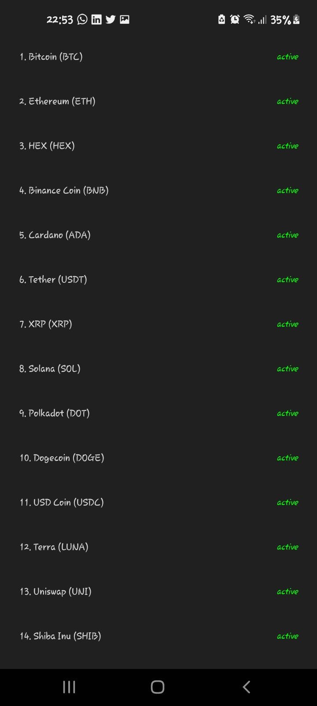
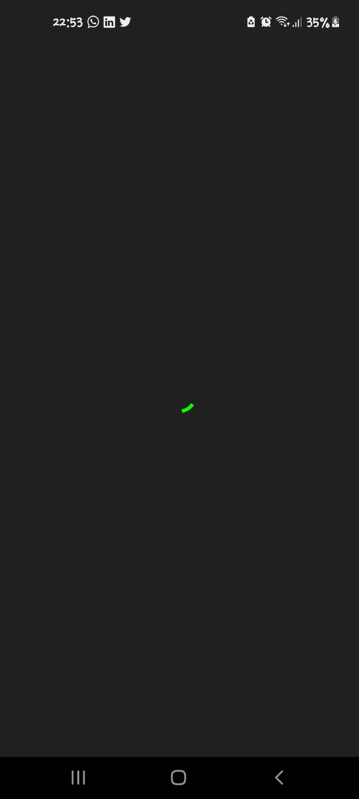
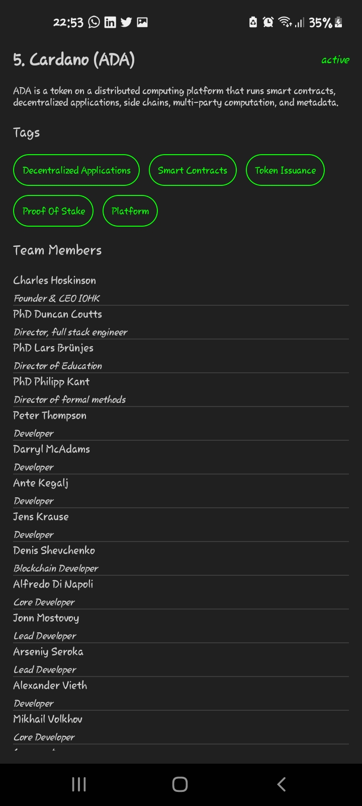

# CryptApp
This is an Android application built with Jetpack Compose. The application can be used to get information about the latest cryptocurrencies.

## Tools
The application was built with the following tools:

> Kotlin 1.5.x

> Android Studio 4.x (arctic fox)

> Gradle 8.x

> Coin Paprika API

## Installation

Simply clone the program to Android Studio. 

Ensure you are running JDK 1.8.x+ in order to use KotlinJVM.

Run the application on an Android Emulator or Physical device running Android 5.0+

## SCREENSHOTS
Have a sneak at the results.
  

  

